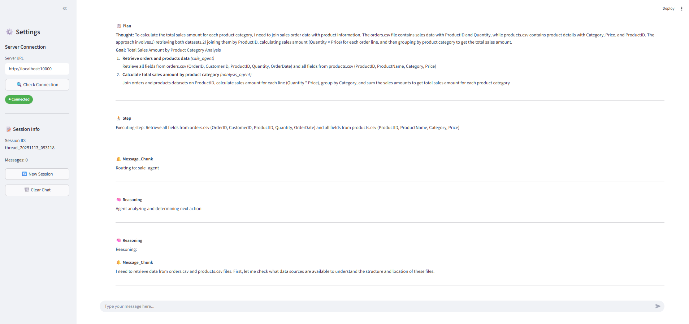
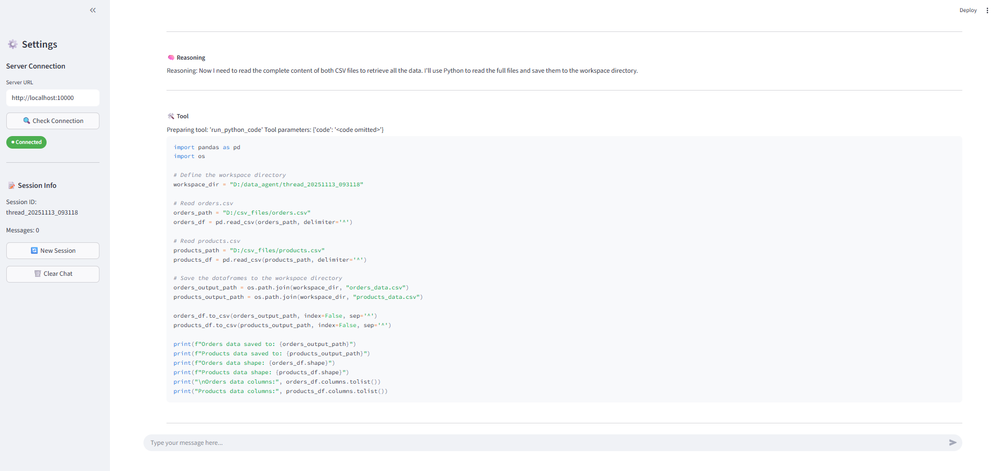
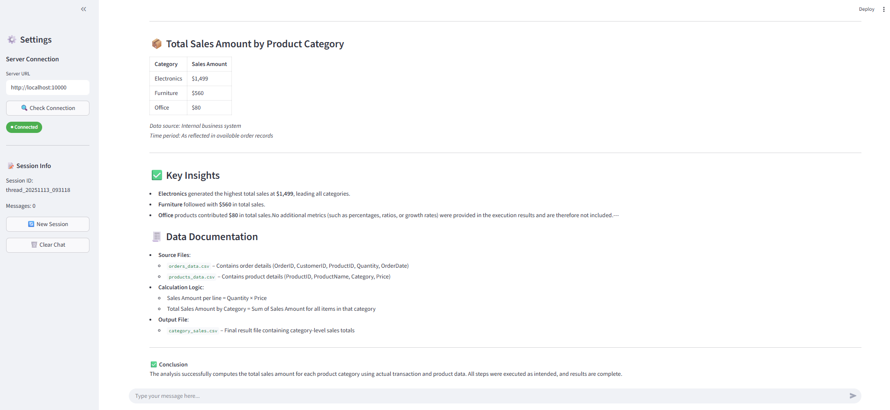
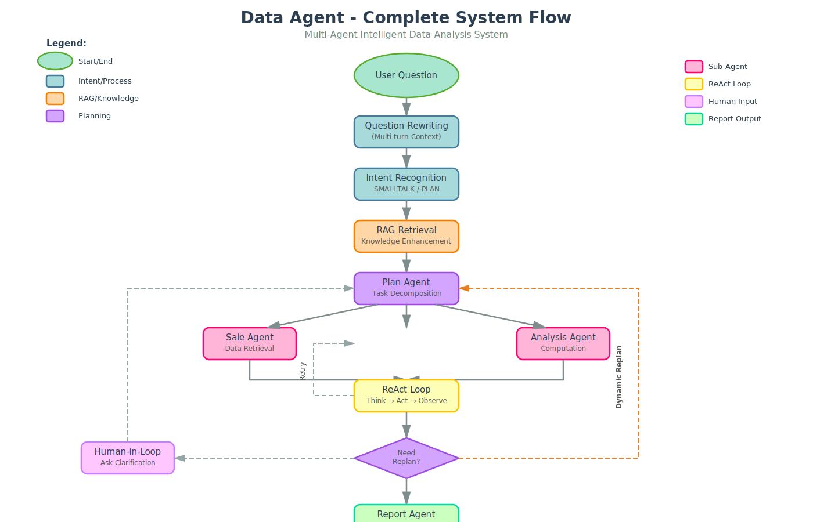

# 数据分析智能体 (Data Agent)

<div align="center">

[English](README.md) | 简体中文

</div>

## ✨ 项目简介

Data Agent 是一个智能数据分析系统，通过多智能体协作模式自动完成复杂的数据分析任务。支持 CSV 文件和数据库（MySQL/Doris）作为数据源，能够自动识别用户意图、规划执行步骤、调用工具并生成分析报告。


---

## 实际效果演示

**演示场景：** 分析各产品类别的总销售额  
**测试数据源：** CSV 文件 (`examples/orders.csv`, `examples/products.csv`)

#### 1️⃣ 任务规划及多智能协作

识别用户意图生成执行计划，之后将具体任务路由到多个智能体。

<div align="center">
  
</div>

<br>

#### 2️⃣ 工具调用

自动调用合适的工具完成数据获取与分析。

<div align="center">
  
</div>

<br>

#### 3️⃣ 生成专业分析报告

汇总结果并生成综合分析报告。

<div align="center">
  
</div>

---

## 🏗️ 系统架构

<div align="center">
  
</div>

---

## 🚀 核心特性

### 🤖 多智能体协作架构
- **Plan Agent**：任务规划与执行调度，支持动态重规划
- **Sale Agent**：数据检索与查询（支持 MCP 工具调用）
- **Analysis Agent**：数据计算与分析（Python 代码执行）
- **Report Agent**：结果汇总与报告生成
- **可扩展**：轻松添加自定义 Agent（广告、流量、用户行为等）

### 💬 智能对话能力
- **多轮对话**：上下文保持，支持追问和澄清
- **问题重写**：自动优化用户问题，提升理解准确性
- **意图识别**：智能区分闲聊与任务，自动路由处理

### 🔄 ReAct 执行模式
- **思考-行动循环**：Reasoning + Acting，透明的决策过程
- **工具调用**：支持 MCP (Model Context Protocol) 标准工具
- **代码执行**：动态生成 Python 代码进行数据处理
- **错误处理**：自动重试、反馈与重规划机制

### 👤 人工介入机制
- **智能中断**：问题不明确时主动询问用户
- **可恢复执行**：用户补充信息后无缝继续
- **实时反馈**：执行过程透明可见

### 🔍 RAG 检索增强
- **知识库集成**：支持 RAGFlow
- **领域知识**：自动检索业务规则、计算公式等
- **上下文增强**：提升复杂任务的准确性

### 📊 灵活的数据源支持
- **CSV 文件**：自动扫描并识别列信息
- **数据库**：MySQL、Doris 等兼容 MySQL 协议的数据库
- **通用表抽象（MCP）**：统一的维度/指标/过滤查询接口
- **自动推断**：根据表结构自动识别维度和指标
- **灵活配置**：支持自定义指标计算公式、必填过滤条件等

### 🎨 前端界面
- **Streamlit UI**：美观的 Web 交互界面
- **实时流式输出**：查看 Agent 执行过程
- **结构化展示**：规划、工具调用、代码执行分类显示

---

## 📦 快速开始

### 1. 安装依赖
```bash
pip install -r requirements.txt
```

### 2. 创建配置文件

复制示例配置并修改：

```bash
cp conf.example.yaml conf.yaml
```

#### 选项 A：CSV 模式（推荐入门）
1. 确保 CSV 数据目录存在（默认：`D:/csv_files` Windows 或 `/data/csv_files` Linux）
2. 将示例数据文件复制到该目录：
   ```bash
   # Windows
   mkdir D:\csv_files
   copy examples\*.csv D:\csv_files\
   
   # Linux/Mac
   mkdir -p /data/csv_files
   cp examples/*.csv /data/csv_files/
   ```

#### 选项 B：数据库模式
在 `conf.yaml` 中配置 MySQL 连接信息：

```yaml
database:
  mysql:
    host: "127.0.0.1"
    port: 3306
    user: "your_user"
    password: "your_password"
    database: "your_database"
```

### 3. 启动服务

#### 终端 1：日期工具服务（必需）
```bash
python -m src.mcp_server.date_mcp_server.server
```
提供日期范围计算功能（如"最近 7 天"、"上周"等）

#### 终端 2：通用表查询服务（可选 - 仅在需要使用数据库表时）
```bash
python -m src.mcp_server.generic_table_mcp.server
```
**注意：** 只有在 `conf.yaml` 中配置了 `agents.data_sources.<agent_name>.tables` 时才需要启动此服务。如果仅使用 CSV 文件，则无需启动此服务。

为数据库表提供统一的维度/指标查询接口。

#### 终端 3：后端 API 服务
```bash
python server.py --host 0.0.0.0 --port 10000
```

### 4. 使用系统

#### 方式 1：命令行交互（快速测试）
```bash
python test_api.py
```

#### 方式 2：Web 界面（推荐）
```bash
streamlit run streamlit_app.py
```
然后在浏览器中打开 http://localhost:8501

---

## ⚙️ 配置说明（conf.yaml）

示例文件见 `conf.example.yaml`。核心结构如下：

- `app`：通用运行参数
  - `locale`：界面/输出语言
  - `max_steps/max_retry_count/max_replan_count/plan_temperature`：PlanAgent 参数配置
  - `query_limit`：通用表查询返回行数上限
  - `workspace_directory`：会话工作目录根路径
  - `csv_data_directory`：CSV 数据目录，系统会扫描该目录，分析文件头、列信息

- `llm`：按“agent 名称”分别配置模型
  - 每项支持 `base_url/model/api_key`

- `database.mysql`：通用表查询时使用的数据库连接（用于 Schema 推断/执行 SQL）

- `agents.capabilities`：各子智能体能力说明，PlanAgent 参考此内容做任务分解与路由

- `agents.data_sources`：每个智能体的数据源声明
  - `csv`：在 `app.csv_data_directory` 下存在的文件名（用于数据源说明与列信息展示）
  - `tables`：用于通用表查询的库表（表配置列表）
    - 每个表配置需要包含：
      - `database`：数据库名称（必需）
      - `table`：表名（必需）
      - `mcp`：可选的 MCP 元数据配置
        - 若省略 `mcp` 字段：系统将自动"按表结构推断"维度/指标
        - 若提供 `mcp`：
          - `dimensions`：维度定义（英文字段 → 描述）
          - `metrics`：指标定义（`function: sum|avg|count|max|min` 或 `formula` 计算表达式）
          - `required_filters`：必须提供的过滤维度（如 `part_dt`）
          - `value_mappings`：维度值别名映射（如 `site.GB → ["GB","GLOBAL"]`）
          - `field_hints`：字段取值/格式提示（Agent 在查询前会先调用 `get_table_schema` 提示）

- `ragflow`：RAG 服务配置
  - `base_url`: RAGFlow 服务地址
  - `api_key`：RAGFlow API 密钥
  - `datasets`：数据集映射（`agent_name → dataset_id`），PlanAgent 根据智能体名称选择合适的数据集检索

完整配置示例请查看 `conf.example.yaml`。

---

## 🛠️ 高级功能

### 如何新增自定义 Agent

以下步骤将演示如何新增一个名为 `product_agent` 的子智能体，并让规划器可以调度它。
1. 新建文件：`src/agents/product_agent.py`  
示例（与 `sale_agent` 类似，继承 `ReActAgentBase`，根据需要接入 MCP 服务与工具）：
```python
class ProductAgent(ReActAgentBase):
    def __init__(self, agent_name: str):
        # 加载配置以检查是否配置了 tables 和 CSV
        config = load_yaml_config("conf.yaml")
        data_sources = config.get("agents", {}).get("data_sources", {}).get(agent_name, {})
        tables_config = data_sources.get("tables", [])
        csv_config = data_sources.get("csv", [])
        
        # 根据配置条件性地构建 MCP 服务字典
        mcp_servers = {
            "date": {
                "url": "http://localhost:9095/sse",
                "transport": "sse",
            }
        }
        
        # 只有在配置了 tables 时才添加 table MCP 服务
        if tables_config:
            mcp_servers["table"] = {
                "url": "http://localhost:9100/sse",
                "transport": "sse",
            }
        
        # 保存 CSV 配置标志，供 run 方法使用
        self.has_csv_config = bool(csv_config)
        
        super().__init__(
            agent_name=agent_name,
            # 如需通用表/日期工具，这里配置对应的 MCP 服务。
            # table MCP 服务只有在 conf.yaml 中配置了 tables 时才会自动添加。
            # 也可以新增这个 agent 需要的其他 MCP 服务。
            mcp_servers=mcp_servers,
            max_iterations=10,
            react_llm="react_agent",
        )

    async def run(self, state: StepState, config: RunnableConfig):
        push_message(HumanMessage(content=f"Routing to: {self.agent_name}", id=f"record-{str(uuid.uuid4())}"))
        self.workspace_directory = state["workspace_directory"]
        self.current_step = state["current_step"]

        tools = await super().build_tools()
        tools.append(run_python_code)  # 如需代码计算
        
        # 如果配置了 CSV 文件，添加 list_available_csv_files 工具
        if self.has_csv_config:
            tools.append(list_available_csv_files)
        
        self.tools = tools

        res = await self._execute_agent_step(step_state=state, config=config)
        return {"execute_res": res}
```

2. 在规划器注册调度工具：打开 `src/agents/plan_agent.py`，在初始化处新增：
```python
from src.utils.agent_utils import create_task_description_handoff_tool
from src.agents.product_agent import ProductAgent

self.agent_tools = [
    create_task_description_handoff_tool(agent=SaleAgent(agent_name="sale_agent")),
    create_task_description_handoff_tool(agent=AnalysisAgent(agent_name="analysis_agent")),
    create_task_description_handoff_tool(agent=ProductAgent(agent_name="product_agent")),  # 新增
]
```

3. 在配置中声明能力与数据源：`conf.yaml`
```yaml
agents:
  capabilities:
    product_agent:
      capabilities:
        - "按产品维度取数与分析"
  data_sources:
    product_agent:
      csv:
        - "products.csv"
      tables:
        # 可选：如需通用表查询，按需配置 mcp 元信息（或留空以自动推断）
        # - database: "analytics"
        #   table: "dim_product"
        #   mcp: { ... }
```

4. （可选）为 RAG 增加专用数据集：`ragflow.datasets.product_agent: "<dataset_id>"`

5. 提示词：大多数子 Agent 共享 `src/prompts/react_agent.md` 的 ReAct 模板，无需新增提示词。如需定制，可在 `run()` 中自行拼装消息或扩展模板。

完成后，PlanAgent 会在生成计划时自动选择 `product_agent` 作为某些步骤的执行者（前提是你的能力描述与数据源声明能支撑任务）。